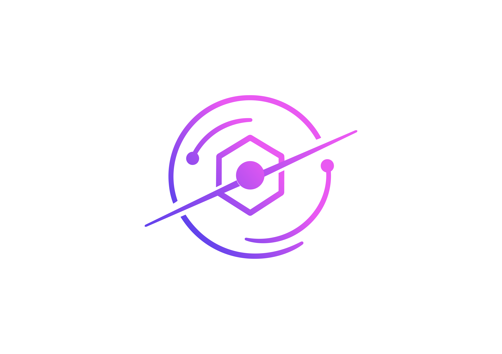

<div align="center">



# Cosmonapse

**Event-driven Agent-to-Agent protocol — agents are plain functions, coordination is messages, there is no orchestrator**

[](https://www.python.org/)
[](https://www.typescriptlang.org/)
[](https://pypi.org/project/cosmonapse/)
[](https://www.npmjs.com/package/@cosmonapse/sdk)
[](LICENSE)
[](#synapse-transports)

[Architecture](#architecture) • [How It Works](#how-it-works) • [Why Cosmonapse](#why-cosmonapse) • [Quick Start](#quick-start) • [Docs](#documentation)

</div>

---

Cosmonapse is an event-driven **Agent-to-Agent (A2A) protocol** with a Python SDK, a TypeScript SDK, and a developer CLI (`cosmo`). It models multi-agent systems on a nervous system instead of a supervisor: agents are pure functions that emit and react to messages on a shared bus, so you grow a system by adding nodes — not by editing a central orchestrator.

[PyPI](https://pypi.org/project/cosmonapse/) · [Envelope Spec](design/ENVELOPE_SPEC.md) · [SDK Design](design/SDK_DESIGN.md) · [Roadmap](design/ROADMAP.md) · [Contributing](CONTRIBUTING.md) · [Changelog](CHANGELOG.md)

## Quick Example

```python
import asyncio
from cosmonapse import Axon, Dendrite, MemoryRegistryStore, connect_synapse

async def main():
    synapse = await connect_synapse("cosmo://127.0.0.1:7070")
    try:
        async def answerer(input, context):
            return {"answer": input["q"]}

        worker = Dendrite(synapse=synapse, namespace="demo")
        worker.attach_axon(Axon(neuron_id="answerer", neuron_fn=answerer))

        orch = Dendrite(synapse=synapse, registry_store=MemoryRegistryStore(),
                        namespace="demo")

        @orch.on_agent_output
        async def done(sig):
            await orch.emit_final(trace_id=sig.trace_id, parent_id=sig.id,
                                  result=sig.payload["output"])

        async with orch, worker:
            await orch.dispatch_task(neuron="answerer", input={"q": "hi"})
            await asyncio.sleep(0.5)
    finally:
        await synapse.close()

asyncio.run(main())
```

## Architecture

Cosmonapse maps a multi-agent system onto a neural metaphor. Every layer is a small, replaceable part — there is no central class that has to know about every agent.

| Abstraction | Plays the role of | What it does |
| --- | --- | --- |
| **Neuron** | The agent | A pure function `(input, context) -> output`. No base class, no inheritance, no framework lock-in. |
| **Axon** | The output path | Wraps a Neuron and turns its return value into a protocol-valid **Signal**. |
| **Dendrite** | The connection point | Attaches Axons to the bus, dispatches work, and reacts to results. Any Dendrite can be a worker, an orchestrator, or both. |
| **Synapse** | The bus | Transports Signals between Dendrites — in-memory, a local dev TCP broker, NATS, or Kafka. |
| **Signal** | The message | The typed envelope every agent emits and reacts to (`TASK`, `RESULT`, `CLARIFICATION`, `PERMISSION`, …). |
| **Engram** | Shared memory | Durable store so granted permissions and answered questions are recalled instead of re-asked. |

The key property: coordination happens by passing Signals, not by reporting up to a master orchestrator. Add a fourth agent and you stand up another Dendrite and point it at the Synapse — you do not edit a god object.

### Synapse transports

The transport is pluggable because Cosmonapse is a protocol, not a runtime. The same agent code runs across every transport — you change a connection string, not your logic.

| Transport | Best for | Connect |
| --- | --- | --- |
| In-memory | Unit tests and single-process apps | `connect_synapse("memory://")` |
| TCP broker | Local multi-process development | `connect_synapse("cosmo://127.0.0.1:7070")` |
| NATS | Production, low-latency fan-out | `pip install "cosmonapse[nats]"` |
| Kafka | Production, durable high-throughput streams | `pip install "cosmonapse[kafka]"` |

## How It Works

```text
 dispatch_task                          emit_final
      │                                      ▲
      ▼                                      │
  ┌─────────┐    TASK     ┌──────────┐    RESULT    ┌─────────┐
  │ Dendrite│ ──────────▶ │   Axon   │ ──────────▶  │ Dendrite│
  │ (orch)  │   Synapse   │ (Neuron) │   Synapse    │ (orch)  │
  └─────────┘             └──────────┘              └─────────┘
                                │
                                │  may pause and ask instead of returning
                                ▼
                    CLARIFICATION / PERMISSION  ──▶  answered by a peer
                                                     or a central Cortex,
                                                     recalled via Engram
```

1. A Dendrite dispatches a `TASK` Signal naming a Neuron and an input.
2. The Synapse routes it to whichever Dendrite has an Axon for that Neuron.
3. The Axon runs the Neuron and emits the output back as a `RESULT` Signal.
4. Any Dendrite subscribed to that result reacts — including emitting the final answer.
5. A Neuron can pause and *ask* instead of returning: a `__clarification__` or `__permission__` marker becomes a `CLARIFICATION` / `PERMISSION` Signal that another Dendrite answers. Human-in-the-loop is just a Signal type, not a bolt-on.
6. Paired with **Engram**, once a question is answered or a permission granted, it is remembered — so agents stop re-asking the same approvals. See [`design/ENVELOPE_SPEC.md`](design/ENVELOPE_SPEC.md) §7.5.

## Why Cosmonapse

A single orchestrator works in the demo. It breaks down when one supervisor has to know every agent, every step, and every branch — it becomes a thousand-line bottleneck every change routes through.

Cosmonapse removes the orchestrator and makes responsibilities explicit:

- Agents are pure functions, not subclasses — nothing to inherit, easy to test in isolation
- Coordination is message-passing on a shared bus, so the system grows sideways instead of onto one chokepoint
- Human-in-the-loop is a first-class Signal type, not custom plumbing
- Shared memory (Engram) means granted permissions and answers are recalled, not re-requested
- The transport is pluggable — the same code runs in-memory for tests and on NATS or Kafka in production

## What You Can Do Today

- Define agents as plain Python (or TypeScript) functions and attach them with a single Axon
- Dispatch and react to work from any node — no central orchestrator class required
- Run the same code across in-memory, local TCP, NATS, and Kafka transports
- Pause an agent to request a clarification or permission and have a peer answer it
- Persist grants and answers in Engram so they are recalled instead of re-asked
- Drive everything from the `cosmo` CLI
- Explore [runnable end-to-end examples](examples/) covering Neurons, providers, Engram, parallel builds, and the orchestrator API

## Quick Start

Choose the shortest path that matches how you want to use Cosmonapse.

| Surface | Best for | Start |
| --- | --- | --- |
| Python SDK | Building and running agents | `pip install cosmonapse` |
| TypeScript SDK | Node / browser agents | `npm install @cosmonapse/sdk` |
| CLI | Terminal-first workflows | one build; `pip install cosmonapse` or `npm i -g @cosmonapse/sdk` |

### Install (Python)

```bash
pip install cosmonapse
```

This installs both `import cosmonapse` and the `cosmo` command. Optional extras: `[nats]`, `[kafka]`, and `[postgres]`. To work against a local checkout instead:

```bash
pip install -e cosmonapse-core/packages/python-sdk
```

See [`packages/python-sdk/README.md`](packages/python-sdk/README.md) for full SDK and CLI documentation.

### Install (TypeScript)

```bash
npm install @cosmonapse/sdk
```

The `cosmo` CLI has a single implementation, shipped in the Python package —
there is exactly one CLI build, so pip and npm users always run identical
tooling. The npm package includes a `cosmo` launcher that installs and runs
it for you:

```bash
npm install -g @cosmonapse/sdk
cosmo --help
```

On first run the launcher looks for a Python that already has `cosmonapse`
installed and delegates to it (`python -m cosmo`). If none is found, it
bootstraps automatically: it creates a private environment under
`~/.cosmonapse/cli-venv` and pip-installs `cosmonapse` pinned to the npm
package's version, so the two stay in lockstep. The only requirement is a
Python 3.11+ interpreter on PATH (`$COSMO_PYTHON` overrides discovery). If
you already `pip install cosmonapse`, its own `cosmo` entry point is the same
code and the launcher simply defers to it.

To work against a local checkout of the SDK:

```bash
cd packages/ts-sdk
npm install
npm run build   # builds dist/index.{js,cjs,d.ts}
```

See [`packages/ts-sdk/README.md`](packages/ts-sdk/README.md) for full SDK documentation.

## Repository Map

| Path | Purpose |
| --- | --- |
| `packages/python-sdk/` | The `cosmonapse` SDK and bundled `cosmo` CLI |
| `packages/ts-sdk/` | TypeScript SDK (+ `cosmo` launcher for npm installs) |
| `packages/prism-ui/` | Prism UI |
| `examples/` | Runnable end-to-end examples |
| `design/SDK_DESIGN.md` | Design rationale |
| `design/ENVELOPE_SPEC.md` | Signal envelope / wire-format spec |
| `design/ENGRAM_DESIGN.md` | Engram (shared memory) design |
| `design/ROADMAP.md` | Roadmap and milestones |
| `design/DECISIONS.md` | Architecture decision log |

## Documentation

- [Python SDK README](packages/python-sdk/README.md) — install, quick start, API, CLI
- [TypeScript SDK README](packages/ts-sdk/README.md) — install, quick start, API, CLI
- [SDK_DESIGN.md](design/SDK_DESIGN.md) — design rationale
- [ENVELOPE_SPEC.md](design/ENVELOPE_SPEC.md) — the Signal wire format
- [ENGRAM_DESIGN.md](design/ENGRAM_DESIGN.md) — shared memory design
- [CONTRIBUTING.md](CONTRIBUTING.md) — how to set up and contribute
- [CHANGELOG.md](CHANGELOG.md) — release notes

## License

[Apache 2.0](LICENSE) © 2026 Aqib Khan
